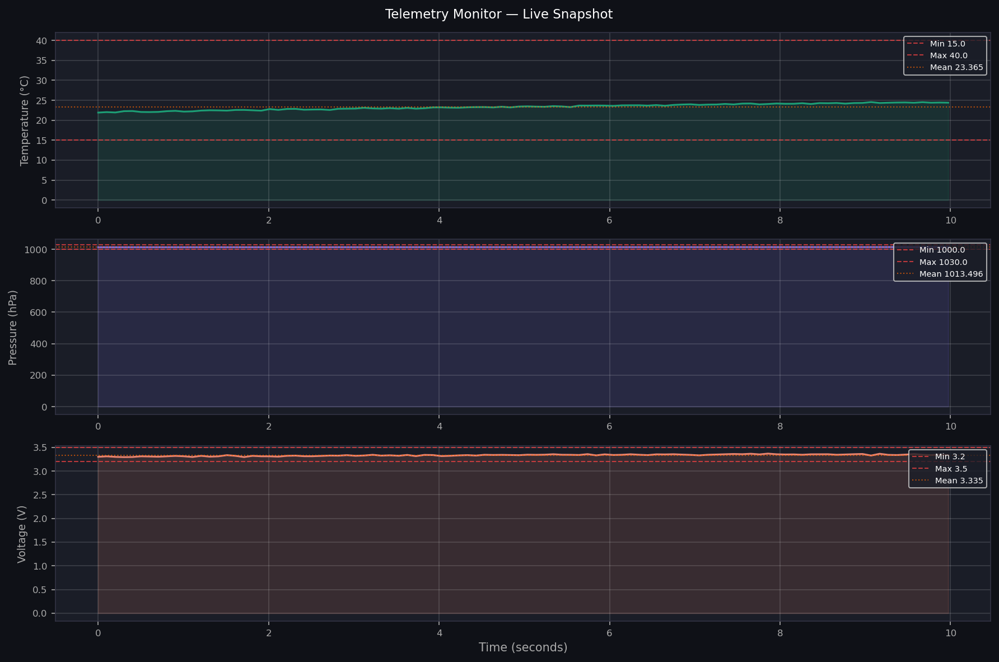

# sat-telemetry-logger

Configurable satellite telemetry capture, parse, log, and monitor tool.

Built as Portfolio Project 2 targeting production hardware engineering
roles in the space sector (HEO, SMC). Demonstrates binary packet parsing,
threaded producer/consumer pipeline, CSV + SQLite dual logging, and
real-time anomaly detection.

---

## Quickstart

```bash
git clone https://github.com/flaxnaz/sat-telemetry-logger.git
cd sat-telemetry-logger
pip install numpy scipy matplotlib pandas pyyaml
python main.py
```

Or with custom parameters:

```bash
python main.py --duration 30 --rate 20
```

---

## Demo Output



---

## Features

- Binary telemetry packet — 24-byte format with checksum validation
- Threaded producer/consumer pipeline — zero packet loss at 10 Hz
- Dual logging — CSV and SQLite simultaneously
- SQL queryable telemetry database
- Anomaly detection — threshold and configurable per channel
- YAML-driven config — no hardcoded values
- CLI arguments — duration, rate, config file

---

## Packet Format

| Bytes | Field | Type | Description |
|---|---|---|---|
| 0-1 | header | uint16 | Magic 0xAA55 |
| 2-3 | packet_id | uint16 | Sequence counter |
| 4-7 | timestamp | uint32 | ms since boot |
| 8-11 | temperature | float32 | deg C |
| 12-15 | pressure | float32 | hPa |
| 16-19 | voltage | float32 | volts |
| 20-21 | status | uint16 | flags |
| 22-23 | checksum | uint16 | sum mod 65536 |

---

## Project Structure
sat-telemetry-logger/
├── main.py          # Entry point — run full pipeline
├── config.yaml      # YAML configuration
├── src/
│   ├── packet.py    # Binary packet pack/unpack
│   ├── stream.py    # Producer/consumer pipeline
│   ├── logger.py    # CSV + SQLite logging
│   └── monitor.py   # Anomaly detection + dashboard
├── output/          # Generated CSV and DB files
└── figures/         # Generated plots

---

## Real Hardware Integration

To connect to a real serial device, replace `SensorProducer` in
`stream.py` with:

```python
import serial
ser = serial.Serial('COM3', baudrate=115200, timeout=1)
raw = ser.read(24)   # read one packet
```

Everything downstream — parsing, logging, anomaly detection —
works unchanged.

---

*Flaxon Nazareth — MEng Space Systems Engineering, UNSW Sydney, 2025*
